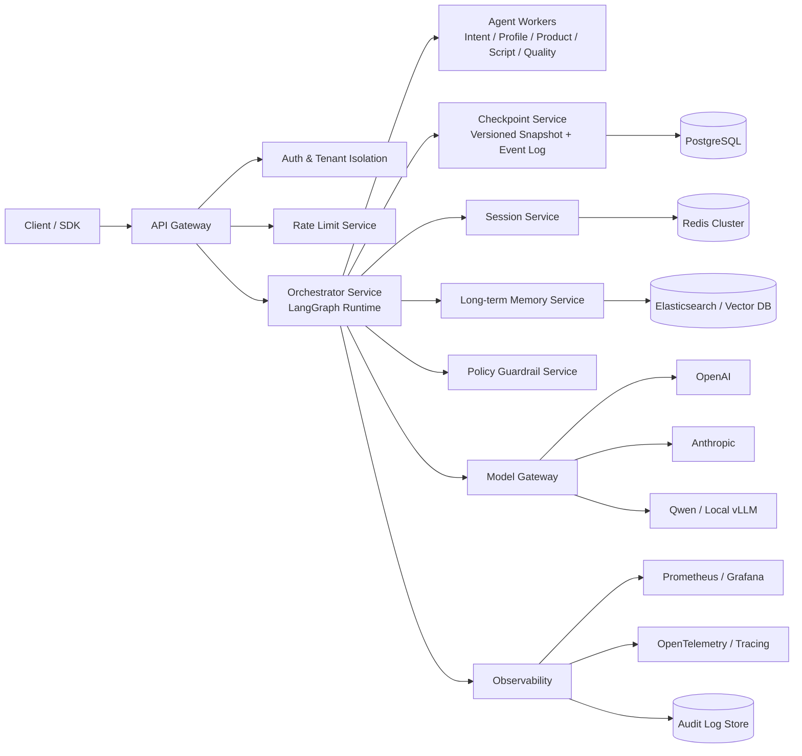

# script_agent Enterprise Blueprint v1

版本: v1.0  
发布日期: 2026-02-16  
适用范围: `script_agent` 生产化改造（多租户、多实例、高可用、可审计）

## 1. 目标与范围

### 1.1 目标

1. 将当前 `script_agent` 升级为可生产落地的 Agent 平台，支持多实例一致并发控制、故障快速恢复、模型多供应商降级。
2. 建立可观测与可审计闭环，覆盖请求链路、状态回放、数据合规、成本治理。
3. 为“达人画像 + 商品信息 + 垂类话术生成”场景提供标准化服务边界，降低迭代成本。

### 1.2 非目标（v1 不做）

1. 不引入复杂多区域多活，仅支持单区域高可用。
2. 不在 v1 建立全自动强化学习反馈，仅提供离线评测与在线 A/B 骨架。
3. 不做全量工作流可视化编排器 UI，仅保留 API 与配置化图定义。

## 2. 目标架构图

## 3. 服务拆分与职责边界

| 服务 | 当前形态 | 目标职责 | 状态存储 | 伸缩策略 |
| --- | --- | --- | --- | --- |
| API Gateway | FastAPI 单体入口 | 鉴权、租户隔离、基础参数校验、入口流控、灰度路由 | 无状态 | 水平扩容 |
| Orchestrator | `script_agent/agents/orchestrator.py` | LangGraph 编排、节点调度、恢复重放、幂等控制 | Redis + Checkpoint API | 按会话哈希分片 |
| Agent Workers | 进程内调用 | Intent/Profile/Product/Script/Quality 节点执行 | 无状态 | 按队列和模型负载扩容 |
| Session Service | `session_manager.py` | 会话上下文读写、短期记忆裁剪、锁协调 | Redis/SQLite | Redis 集群 |
| Checkpoint Service | `checkpoint_store.py` | 版本化快照、事件日志、回放、审计查询 | PostgreSQL | 分区表 + 索引 |
| Long-term Memory | `long_term_memory.py` | embedding 入库、向量召回、过滤重排、TTL 清理 | ES/向量库 | 按 tenant 分索引 |
| Model Gateway | `llm_client.py` | 多模型路由、超时重试、熔断、降级、成本配额 | Redis + Postgres | 无状态 |
| Policy Guardrail | 部分在 Prompt/质检 | PII、禁用词、工具白名单、输出约束校验 | Postgres | 热更新规则 |
| Observability | `metrics.py` + 日志 | 指标、追踪、审计、告警、质量评测数据沉淀 | Prometheus + Trace + DW | 独立部署 |

## 4. 核心设计原则

1. 幂等优先: 所有写路径基于 `request_id + session_id + graph_version` 去重。
2. 事件优先: 状态更新必须先落事件日志，再更新最新快照。
3. 可恢复优先: 任意节点失败后可从最近 checkpoint 恢复，不重复执行成功节点。
4. 降级优先: 主模型失败时秒级切换备用模型，确保服务连续性。
5. 合规优先: 记忆、日志、审计必须支持脱敏、TTL、可删除。

## 5. SLO / SLI / 告警阈值

### 5.1 SLO（v1）

| 维度 | 指标 | SLO |
| --- | --- | --- |
| 可用性 | `/api/v1/generate` 成功响应率（月） | >= 99.95% |
| 时延 | 首 token 延迟 `p95` | <= 2.5s |
| 时延 | 全响应延迟 `p95` | <= 8s |
| 恢复能力 | 节点故障恢复成功率 | >= 99.0% |
| 并发一致性 | 同会话冲突后最终失败率 | <= 0.1% |
| 降级能力 | 主模型失败后 60s 内切换成功率 | >= 99.0% |
| 质量 | 质检一次通过率 | >= 95.0% |

### 5.2 Error Budget（按 30 天）

1. 可用性 99.95% 对应不可用预算约 21.6 分钟/月。
2. 若连续 7 天预算消耗超过 30%，冻结非紧急发布并进入稳定性修复窗口。

### 5.3 告警（建议）

1. P1: 5 分钟内可用性低于 99.0%，立即告警并触发自动降级。
2. P1: 模型网关熔断打开超过 3 分钟，升级人工值班。
3. P2: `p95` 全响应 > 10s 持续 15 分钟，触发性能排查。
4. P2: checkpoint 写入失败率 > 0.5% 持续 10 分钟，切只读保护。

## 6. 数据模型（v1）

### 6.1 逻辑模型

1. `sessions`: 会话主表，管理租户、用户、状态、当前图版本。
2. `conversation_turns`: 对话轮次与 token 统计，支持恢复与审计。
3. `checkpoint_events`: 事件日志，记录节点开始/成功/失败/重试。
4. `checkpoint_snapshots`: 节点或阶段快照，支持秒级恢复。
5. `memory_documents`: 长期记忆文本、标签、PII 级别、TTL。
6. `memory_embeddings`: 向量及模型元数据，支持多 embedding 模型演进。
7. `product_profiles`: 商品结构化画像与合规标签。
8. `creator_profiles`: 达人风格、禁用表达、品牌策略标签。
9. `llm_call_logs`: 模型调用、成本、时延、降级链路。
10. `audit_logs`: 管理操作与策略变更审计。

### 6.2 建表示意（字段级）

| 表名 | 关键字段 | 说明 |
| --- | --- | --- |
| `sessions` | `session_id(pk)`, `tenant_id`, `user_id`, `status`, `graph_version`, `created_at`, `updated_at` | 会话元数据 |
| `checkpoint_events` | `event_id(pk)`, `session_id`, `version`, `node`, `event_type`, `payload_json`, `trace_id`, `created_at` | 可回放事件流 |
| `checkpoint_snapshots` | `snapshot_id(pk)`, `session_id`, `version`, `node`, `state_json`, `checksum`, `created_at` | 最新恢复点 |
| `memory_documents` | `memory_id(pk)`, `tenant_id`, `session_id`, `text`, `tags_json`, `pii_level`, `expires_at` | 长期记忆文本 |
| `memory_embeddings` | `memory_id(fk)`, `embedding_model`, `dim`, `vector_ref`, `index_name`, `created_at` | 向量索引映射 |
| `llm_call_logs` | `call_id(pk)`, `provider`, `model`, `tokens_in`, `tokens_out`, `latency_ms`, `status`, `fallback_from`, `created_at` | 成本与故障分析 |

### 6.3 数据治理

1. 会话短期记忆: 按轮次上限与摘要压缩规则裁剪。
2. 长期记忆: 分级保存（热/温/冷），默认 TTL，支持删除请求追踪。
3. 审计日志: 至少保留 180 天，敏感字段脱敏后入库。
4. embedding 演进: 支持双索引并行回填，灰度切换检索模型。

## 7. 关键流程（生产要求）

### 7.1 生成请求流程

1. API 网关鉴权与租户识别。
2. QPS + Token 双限流判定。
3. 获取分布式会话锁（Redis）。
4. Orchestrator 加载最新 checkpoint 与会话上下文。
5. 执行 LangGraph 节点（Intent -> Profile -> Product -> Script -> Quality）。
6. 每节点写入 `checkpoint_events`，关键节点写 `checkpoint_snapshots`。
7. 失败时触发模型网关重试/降级；仍失败则记录审计并返回可恢复状态。
8. 成功后释放锁，异步写长期记忆与指标。

### 7.2 故障恢复流程

1. 基于 `session_id` 拉取最近成功 snapshot。
2. 校验 snapshot `checksum` 与 graph 版本兼容性。
3. 从最后成功节点续跑，并标记恢复来源。
4. 若恢复失败，降级到上一个稳定版本图并触发人工告警。

## 8. 里程碑（v1 交付计划）

### M1: 稳定性底座（2026-02-16 至 2026-03-01）

1. 完成 Redis 分布式锁全链路接管，去掉进程内锁主路径。
2. 接入统一限流与模型网关熔断降级。
3. 接入 OpenTelemetry Trace，贯穿 API -> Orchestrator -> LLM。

验收标准:
1. 多实例并发压测下无会话写冲突。
2. 主模型故障可在 60 秒内完成可观测降级。

### M2: 状态与记忆（2026-03-02 至 2026-03-22）

1. checkpoint 拆分为事件日志 + 快照，支持版本回放与审计 API。
2. 会话记忆裁剪策略参数化（按租户可配）。
3. 长期记忆检索链路完善（召回 + 过滤 + 重排）。

验收标准:
1. 任意节点失败可恢复续跑。
2. 回放接口可还原关键执行路径与输入输出摘要。

### M3: 质量与治理（2026-03-23 至 2026-04-12）

1. 引入策略引擎（PII/禁用词/风格约束/品牌规则）。
2. 建立离线评测集与线上 A/B 机制。
3. 发布 Runbook（故障、扩容、回滚、降级演练）。

验收标准:
1. 达到本文件定义 SLO。
2. 具备生产值班与审计合规要求。

## 9. 组织与运维要求

1. 版本策略: 采用 `VERSION + CHANGELOG.md`，每次发布必须更新迁移说明。
2. 发布策略: 金丝雀发布 + 5% 灰度，观测稳定后全量。
3. 回滚策略: 保留前一稳定镜像与图版本，支持 5 分钟内回滚。
4. 值班策略: P1 7x24，P2 工作时段 + 自动告警聚合。

## 10. v1 交付物清单

1. `enterprise-blueprint-v1.md`（本文件）
2. 架构配置基线（锁、限流、降级、checkpoint、记忆）
3. SLO 仪表盘与告警规则
4. 数据表 DDL 与迁移脚本
5. 故障演练与恢复 Runbook

